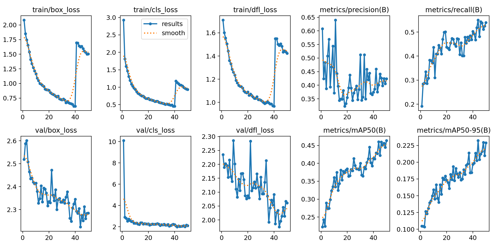
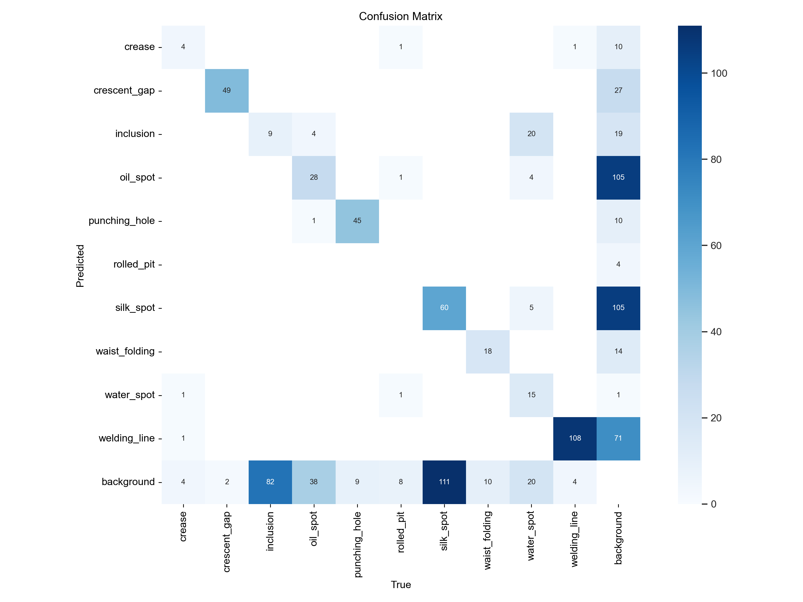
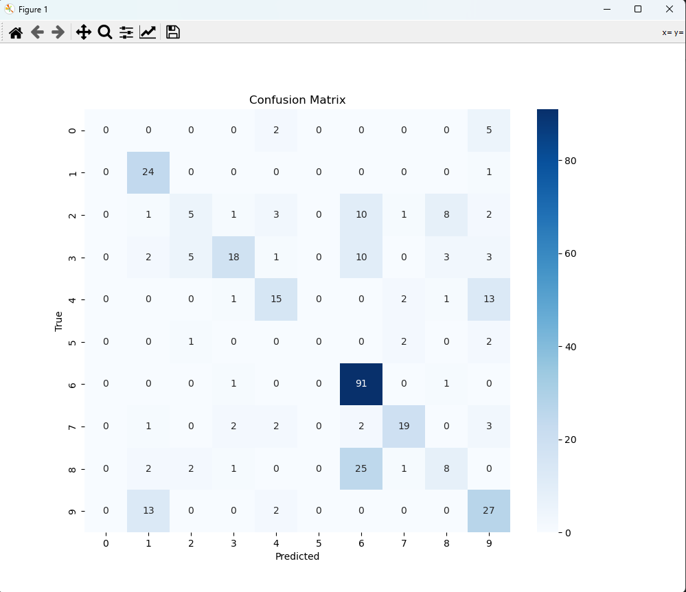
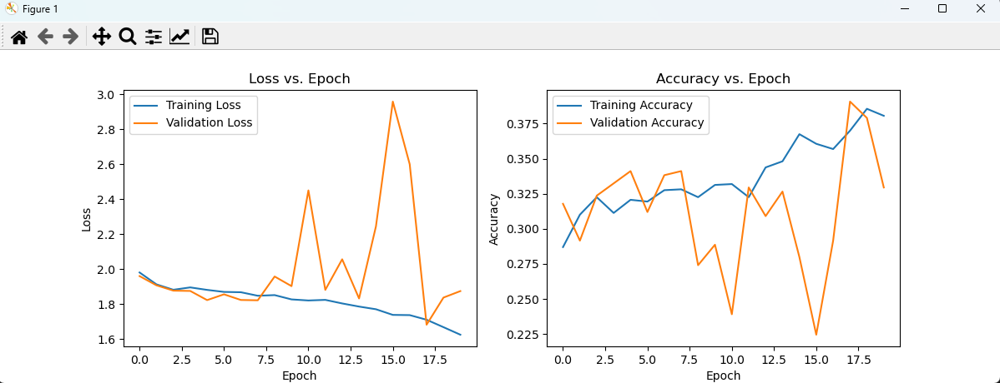

### Defect Detection in Metal Casting

An image-based quality-inspection project for classifying, locating, and segmenting defects in metal castings. The project compares classical machine-learning classifiers with YOLOv8 object detection and X-Net semantic segmentation using a custom industrial dataset and the public GC10-DET dataset.

## Technologies

- `Python 3.9`
- `PyTorch`
- `Ultralytics YOLOv8`
- `X-Net`
- `OpenCV`
- `Scikit-learn`
- `NumPy`
- `Pandas`
- `Matplotlib`
- `Seaborn`
- `Jupyter Notebook`
- `Google Colab`
- `LabelImg`

## Features

- Classifies metal-casting defects using six classical ML algorithms
- Detects and localizes defects with YOLOv8 bounding boxes
- Segments defect boundaries at pixel level with X-Net
- Processes grayscale industrial images
- Converts annotations into YOLO-compatible labels
- Compares original and rotation-augmented datasets
- Evaluates models using accuracy, precision, recall, F1-score, mAP, IoU, Dice coefficient, and pixel accuracy

## Datasets

### Custom industrial dataset

Images were collected with Primeseal Group of Companies Pvt. Ltd., Rajkot. The initial collection contained 2,552 images across nine defect categories:

- Cutting marks
- Hot tears or cracks
- Inclusion
- Porosity
- Scabs
- Shrink
- Surface roughness
- Veining
- Wrinkles, folds, or cold shuts

After removing blurred, overlapping, and incorrectly labelled samples, 842 images were retained in the documented cleaning table. Another section of the report describes a 1,756-image resized dataset, so these counts represent different documented processing stages and should not be combined.

### GC10-DET

The public GC10-DET dataset contributed approximately 2,294 annotated images across 10 metal-surface defect classes. Bounding-box annotations were converted into YOLO-compatible text files. Images were resized to 640 × 640 for YOLOv8, while 1024 × 512 crops were used for X-Net segmentation.

## Models

Classical classifiers:

- Logistic Regression
- Decision Tree
- K-Nearest Neighbors
- Support Vector Classifier
- Random Forest
- Naive Bayes

Deep-learning models:

- YOLOv8 for object detection and localization
- X-Net for pixel-level semantic segmentation

## Results

### YOLOv8

- mAP@0.5: approximately 87.6%
- Average precision: 85.2%
- Average recall: 82.5%
- Average F1-score: 83.8%
- Processing speed: up to 25 FPS on the tested GPU system

### X-Net

- Mean IoU: 76.3%
- Dice coefficient: 81.4%
- Pixel accuracy: 88.9%

Among the classical models, the Decision Tree achieved the highest documented post-augmentation accuracy of 98% after rotation of the full dataset. SVC remained consistent at 94% after augmentation, while Naive Bayes performance declined.

## The Process

The project started with collection and cleaning of grayscale industrial images across nine casting-defect categories. Images that were blurred, overlapping, or incorrectly labelled were removed. The data was then evaluated in its original form and after rotation-based augmentation.

Six classical machine-learning classifiers were trained to establish comparison baselines. YOLOv8 was added to detect multiple defect types and localize them with bounding boxes. X-Net complemented the detection pipeline by producing pixel-level segmentation masks for defect boundaries and shapes.

The models were evaluated using metrics suited to each task: classification metrics for the traditional models, mAP and confidence-based curves for YOLOv8, and IoU, Dice coefficient, and pixel accuracy for X-Net.

## What I Learned

- Building and cleaning an industrial image dataset
- Managing class imbalance and image augmentation
- Converting annotation formats for YOLO training
- Comparing classification, object-detection, and segmentation approaches
- Selecting evaluation metrics based on the prediction task
- Using confusion matrices and performance curves to investigate model errors
- Working with GPU-based training and model optimization

## Possible Improvements

- Add synthetic and noisy samples to improve generalization
- Optimize YOLOv8 for NVIDIA Jetson or other edge hardware
- Apply pruning, quantization, and TensorRT optimization
- Integrate detection and segmentation into a production-line inspection workflow

## Running the project

- download the [requirements](requirements.txt)
- download the [running-the-project.md](Running-the-Project.md) for detailed instructions

## Preview

### Yolov8 train

---

### Yolov8 Confusion-matrix

---

### X-Net

---

### X - Net train vs loss

---

## Contributors

Mansiba Gohil
